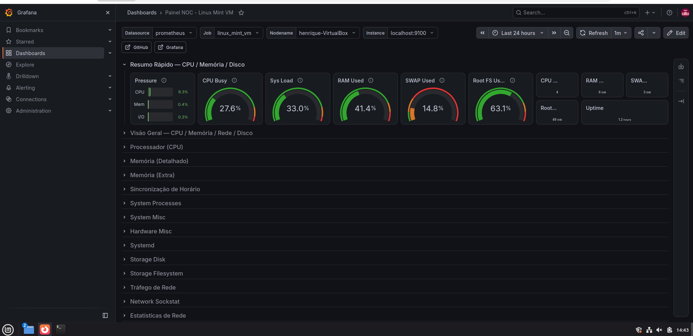
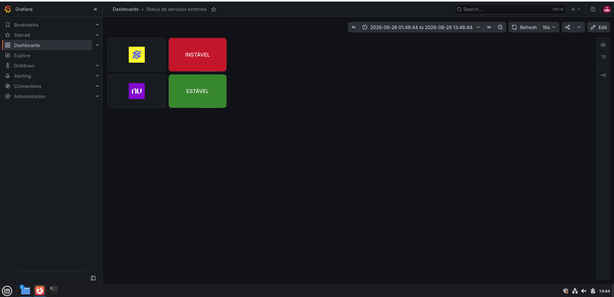
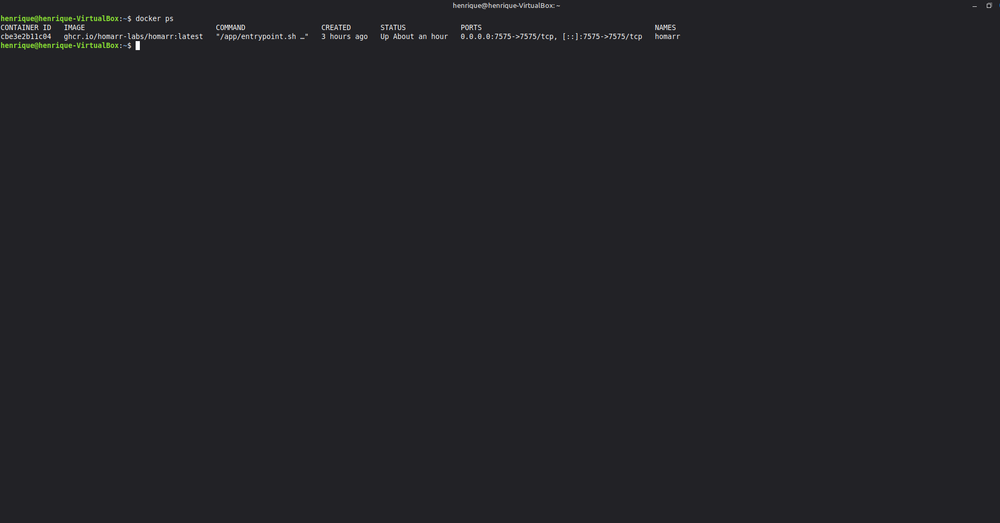
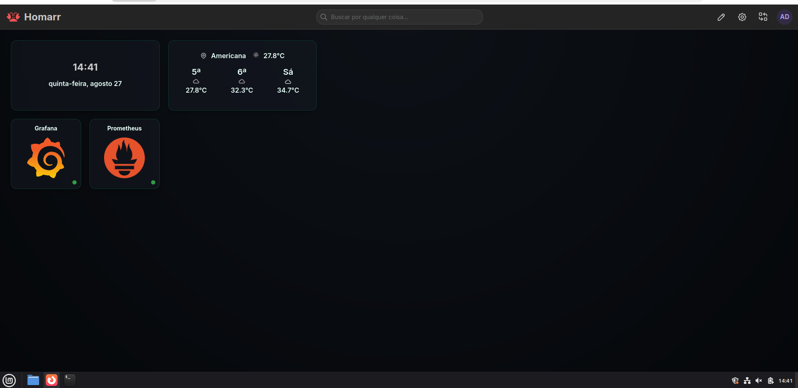

# 🖥️ Homelab Linux — Laboratório de Infraestrutura e Observabilidade

Laboratório pessoal construído do zero em ambiente Linux (Linux Mint, virtualizado), com foco em observabilidade, containerização e gestão centralizada de serviços. Projeto contínuo, usado para consolidar na prática conhecimentos de infraestrutura, automação e boas práticas de administração de sistemas.

## 🎯 Objetivo

Simular, em ambiente controlado, um pequeno "data center" doméstico — aplicando conceitos usados em ambientes corporativos reais (monitoramento, containers, segurança, documentação) para acelerar o aprendizado prático em infraestrutura Linux e DevOps.

## 🧱 Stack e Tecnologias

| Categoria | Ferramentas |
|---|---|
| Sistema Operacional | Linux Mint (base Ubuntu/Debian) |
| Virtualização | Oracle VirtualBox |
| Monitoramento | Prometheus, Node Exporter, Grafana |
| Containerização | Docker, Docker Compose |
| Dashboard / Central de Controle | Homarr |
| Controle de versão | Git, GitHub |

## 📊 Projeto 1 — Stack de Observabilidade (Prometheus + Grafana + Node Exporter)

Implementação de uma stack de monitoramento self-hosted, do zero, em uma VM Linux Mint, no estilo dos painéis de NOC (Network Operations Center) usados em ambientes corporativos.

**O que foi feito:**
- Instalação e configuração do Node Exporter, coletando métricas do sistema (CPU, memória, disco, rede, load average)
- Instalação e configuração do Prometheus como motor de coleta e armazenamento de séries temporais, com scrape configurado via prometheus.yml
- Configuração de serviços systemd dedicados para cada componente, seguindo boas práticas de segurança (usuários de sistema sem privilégio de login)
- Instalação do Grafana e conexão como fonte de dados ao Prometheus
- Importação e customização de dashboard visual (Node Exporter Full), com tema escuro e auto-refresh, para visualização em tempo real

**Habilidades demonstradas:** administração de serviços Linux via systemd, configuração de métricas e séries temporais, criação de dashboards de observabilidade, hardening básico de serviços.

## 🐳 Projeto 2 — Ambiente de Containers com Docker

Configuração de ambiente Docker na VM Linux Mint para deploy e gerenciamento de aplicações containerizadas, incluindo resolução de conflitos de repositório entre distribuições baseadas em Debian/Ubuntu.

**O que foi feito:**
- Instalação do Docker Engine e Docker Compose, com correção de conflitos de repositório APT (identificação de configuração incorreta apontando para repositório Debian em um sistema Ubuntu-based)
- Configuração de containers via docker-compose.yml, incluindo gerenciamento de variáveis de ambiente sensíveis (chaves de criptografia)
- Diagnóstico de erros de inicialização de container via docker logs, identificando e corrigindo variáveis de ambiente inválidas

.

**Habilidades demonstradas:** troubleshooting de repositórios APT, gestão de containers Docker, leitura e diagnóstico de logs, resolução de problemas de configuração.

## 🎛️ Projeto 3 — Dashboard Central (Homarr)

Implementação de um painel visual centralizado para gestão de todos os serviços do laboratório, eliminando a necessidade de navegação manual entre múltiplos endereços IP/porta.

**O que foi feito:**
- Deploy do Homarr via Docker Compose, com integração ao Docker socket para exibição de status de containers
- Cadastro e organização de aplicações (Grafana, Prometheus) com widgets de status em tempo real
- Customização visual do painel via CSS personalizado

.

**Habilidades demonstradas:** deploy de aplicações via Docker Compose, integração entre serviços, customização de interface (CSS).

## 🔐 Boas Práticas de Segurança Aplicadas

- Nenhuma credencial, chave de API ou variável sensível é versionada neste repositório (ver .gitignore)
- Serviços rodando com usuários dedicados de sistema (sem privilégio de login), quando aplicável
- Ambiente isolado em VM, sem exposição direta à internet

## 🗺️ Próximos Passos

- [ ] VPN pessoal (WireGuard) + DNS filtering (Pi-hole)
- [ ] Servidor de domínio (Samba AD DC)
- [ ] Automação de configuração com Ansible
- [ ] Reverse proxy com HTTPS (Nginx Proxy Manager)

## 📌 Observação

Este é um projeto de estudo pessoal, em evolução contínua, documentado para consolidar aprendizado prático em infraestrutura Linux, observabilidade e containerização.

---

**Autor:** Henrique Casotti
